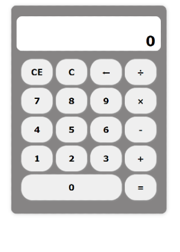
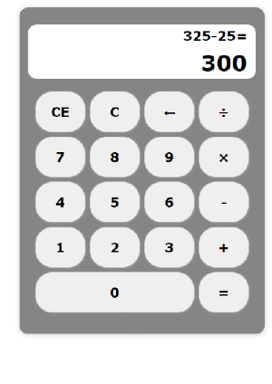

### CALCULADORA

## PREVIEW

- Herramientas usadas:
    - HTML5
    - CSS3
    - Javascript

- Version 0.1:
    - Realiza operaciones básicas: suma, resta, multiplicación y división
    - Usado GRID para el posicionamiento de botones
    - ToDo: Añadir cáracter para números decimales y... más! 